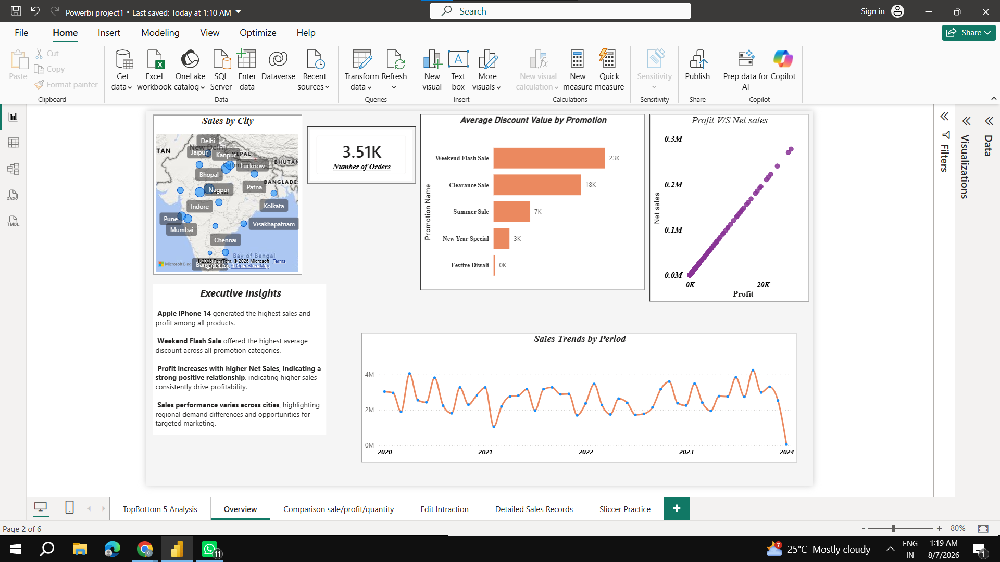
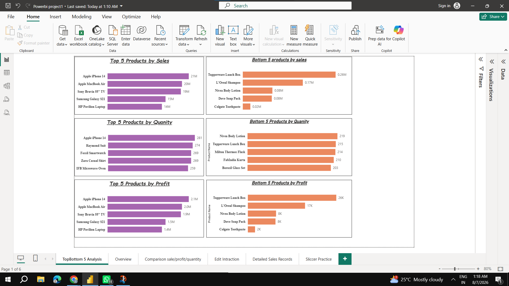
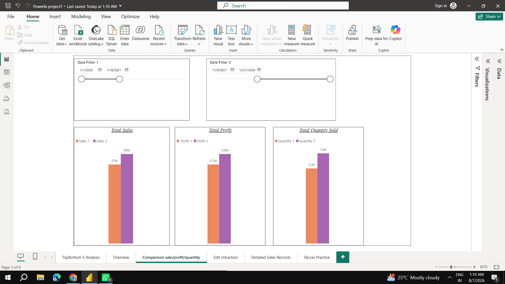
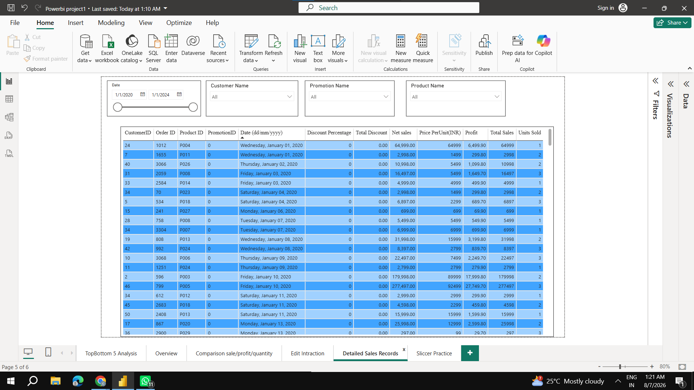
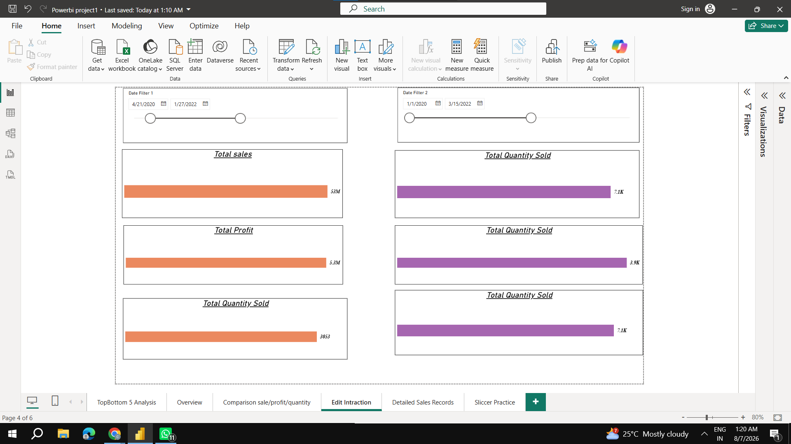

# ElectroHub Sales Analysis Dashboard

An interactive Power BI dashboard built for a retail electronics company (ElectroHub), analyzing sales, profit, quantity, and discount performance across products, cities, and time periods to answer 8 core business requirements.

## Overview

- **Tools used:** Power BI Desktop, DAX, Power Query, Data Modeling
- **Goal:** Build a multi-page, interactive dashboard enabling stakeholders to explore sales performance by product, city, time period, and promotion — including custom two-period comparisons.

## Business Requirements Answered

1. Top/Bottom 5 products by Sales, Profit, and Quantity Sold
2. Sales trend analysis across daily, monthly, quarterly, and annual views (drill-down enabled)
3. Relationship between Sales and Profit
4. Custom comparison of Sales/Profit/Quantity between any two user-selected periods
5. Average discount offered by promotion category
6. Total number of orders
7. Fully filterable order-level detail (by Product, Date, Customer ID, Promotion)
8. Sales performance by city

## Dashboard Pages

- **Overview** — KPI summary, sales by city (map), average discount by promotion, profit vs. net sales, sales trend over time, and an Executive Insights panel
- **TopBottom 5 Analysis** — Top and bottom 5 products by Sales, Quantity, and Profit
- **Comparison (Sales/Profit/Quantity)** — Side-by-side comparison of any two custom date ranges using independent date filters
- **Detailed Sales Records** — Filterable order-level table (Customer, Product, Date, Promotion, Discount, Net Sales, Profit)

## Key Insights

- Apple iPhone 14 generated the highest sales and profit among all products.
- Weekend Flash Sale offered the highest average discount across all promotion categories.
- Profit increases with higher Net Sales, indicating a strong positive relationship between the two.
- Sales performance varies notably across cities, highlighting regional demand differences and opportunities for targeted marketing.

## Features

- Multi-page interactive dashboard
- Dynamic KPI cards
- Drill-down enabled sales trend analysis
- Independent two-period comparison using dual date slicers
- Interactive map visualization
- Executive Insights panel
- Fully filterable transaction-level report

## How to View

1. Download `ElectroHub_Dashboard.pbix`
2. Open in Power BI Desktop
3. Use the date filters, slicers, and drill-down controls on each page to explore the data interactively

## Dashboard Pages

### 1. Overview

### 2. Top & Bottom 5 Analysis

### 3. Sales Comparison

### 4. Detailed Sales Records

### 5. Edit Interaction

---
*Built as part of a Data Analyst portfolio project.*
